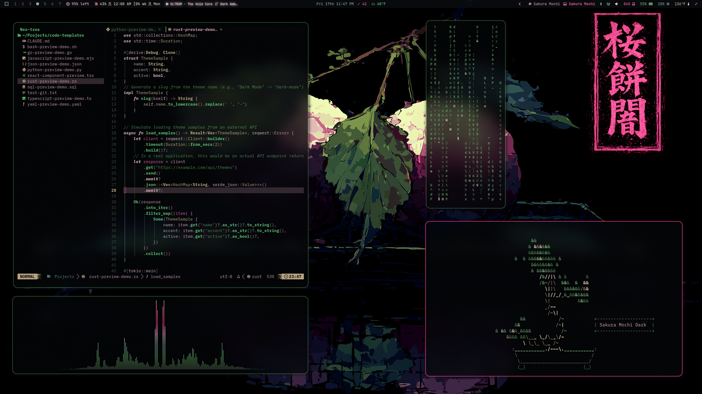
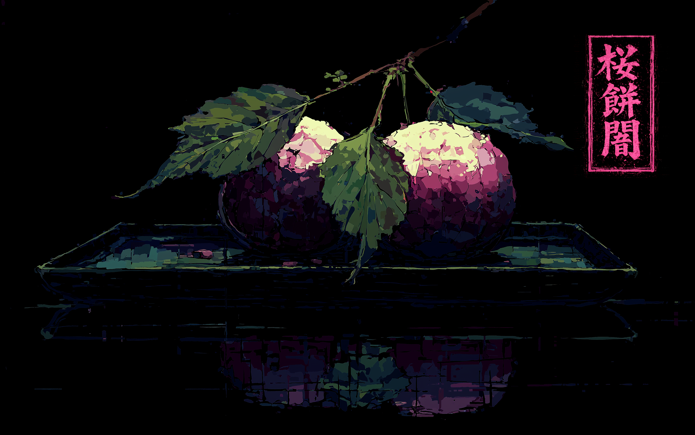
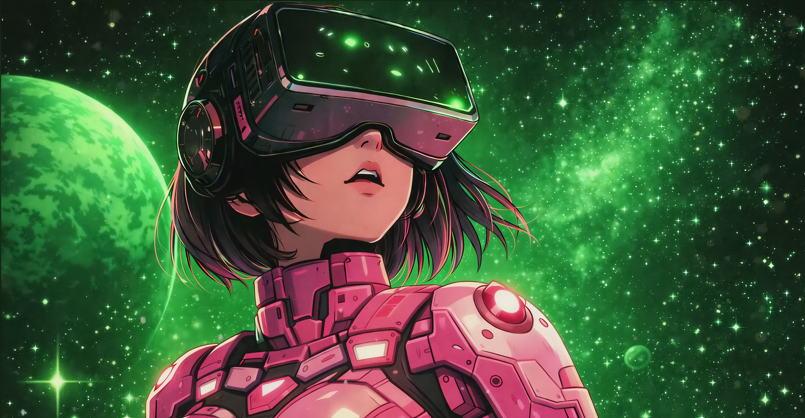
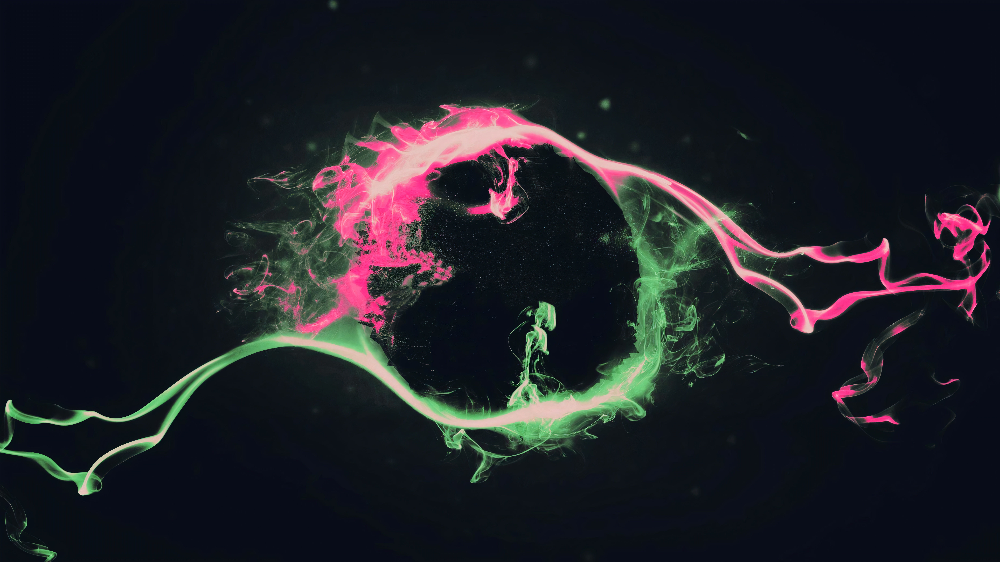
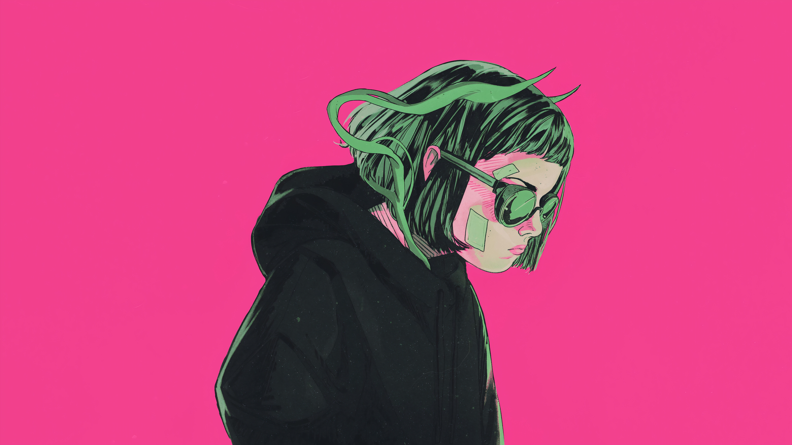
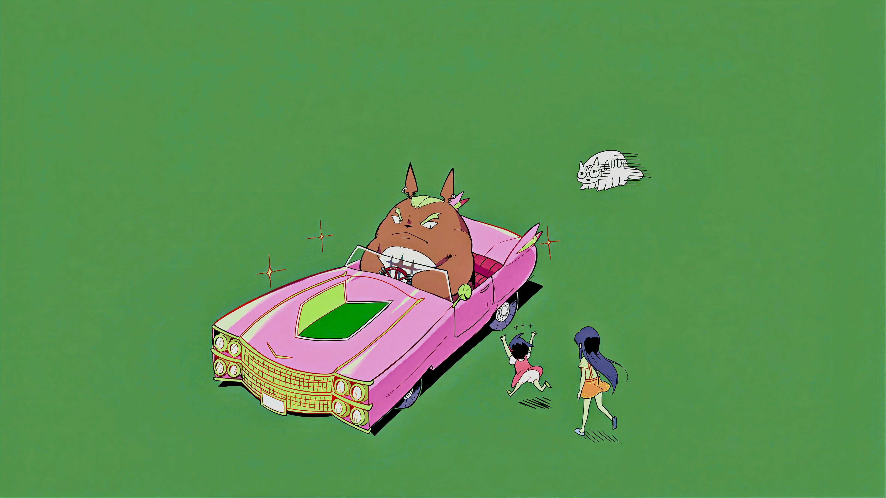

# Omarchy Sakura Mochi Theme

Sakura Mochi is a dark glass Omarchy theme built on pink bloom, cool green structure, and a near-black lacquer base. It keeps the shell soft and plush instead of sugary, with sakura-tinted borders, rounded surfaces, and just enough retro-futurist glow to hold its shape against louder wallpapers.

## Preview



## Install

Use the Omarchy theme installer:

```bash
omarchy-theme-install https://github.com/OldJobobo/omarchy-sakura-mochi-theme
```

## What's Included

- Rounded Hyprland, Hyprlock, Waybar, Mako, Walker, and SwayOSD styling built around the theme's pink-and-green glass shell.
- A standalone [Vencord theme](vencord.theme.css) with its own layered Discord treatment instead of a thin palette pass-through.
- A custom [Neovim theme override](neovim.lua) for `bjarneo/aether.nvim` with Sakura Mochi-specific highlight tuning.

## Wallpapers

<table>
  <tr>
    <td></td>
    <td></td>
    <td></td>
  </tr>
  <tr>
    <td></td>
    <td></td>
    <td></td>
  </tr>
  <tr>
    <td></td>
    <td></td>
    <td></td>
  </tr>
</table>

## Requirements

- `Yaru-magenta` icon theme

## Notes

- `colors.toml` is the palette source of truth for the repo.
- The shell is intentionally darker and calmer than the wallpaper set; the wallpapers are allowed to be loud, the UI is not.
